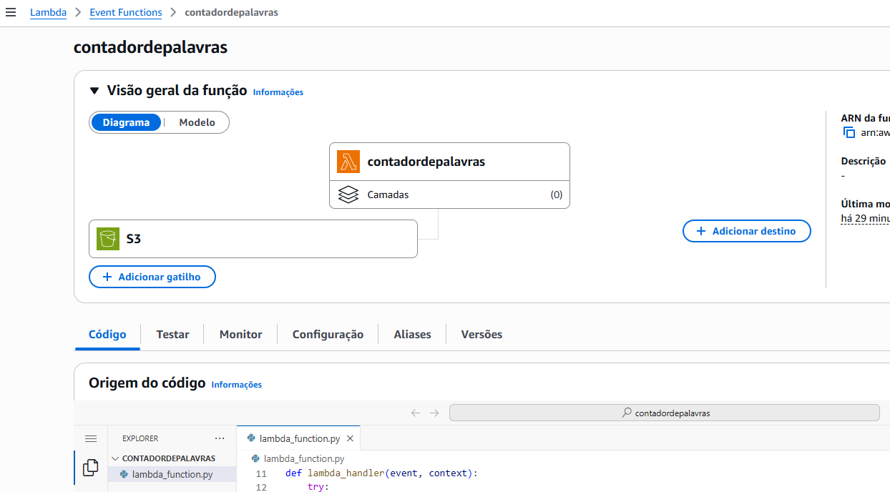
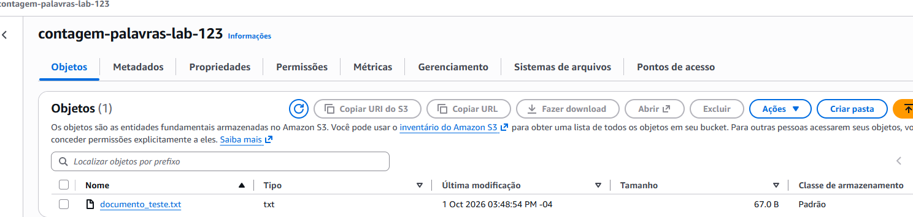
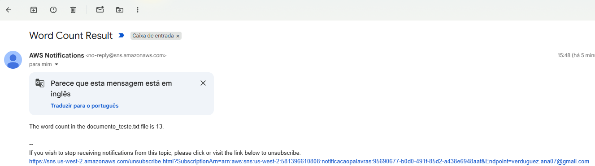
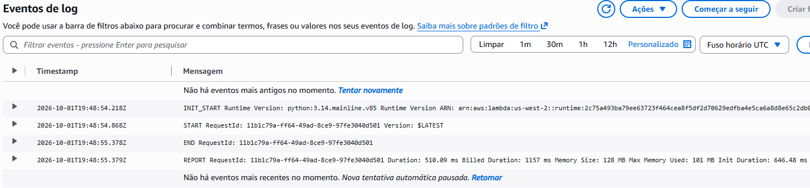

# 🚀 AWS Serverless Word Counter & Notification Pipeline

Pipeline de processamento assíncrono orientado a eventos (Event-Driven Architecture) desenvolvido na Amazon Web Services (AWS) para análise automatizada de ficheiros de texto e envio de relatórios por correio eletrónico.

---

## 📌 Visão Geral da Solução

O objetivo do projeto foi construir um fluxo serverless desacoplado e escalável:
Sempre que um ficheiro de texto (.txt) é carregado num bucket do *Amazon S3, um evento automático aciona a função **AWS Lambda. A função processa o documento, realiza a contagem total de palavras e publica o relatório num tópico do **Amazon SNS*, notificando o utilizador final por e-mail em tempo real.

---

## 🛠️ Serviços Utilizados

- *Amazon S3*: Repositório de objetos e gatilho de eventos.
- *AWS Lambda: Computação sem servidor (*serverless) com *Python 3.12* e *Boto3*.
- *Amazon SNS: Serviço *Pub/Sub para distribuição de mensagens e alertas.
- *AWS IAM*: Gestão de privilégios de execução com funções seguras.
- *Amazon CloudWatch*: Monitorização, métricas de desempenho e diagnóstico de logs em tempo real.

---

## 📸 Evidências de Execução e Testes

### 1. Arquitetura e Gatilho no AWS Lambda
A função contadordepalavras integrada diretamente ao gatilho do Amazon S3:

### 2. Carregamento de Objeto no Amazon S3
Ficheiro de teste armazenado com sucesso no bucket:

### 3. Notificação Recebida por E-mail (Amazon SNS)
Mensagem entregue com o assunto Word Count Result e a contagem exata de palavras:

### 4. Observabilidade e Logs no Amazon CloudWatch
Execução concluída com sucesso sem erros de execução:

---

## 🧠 Desafios Técnicos e Aprendizagens

- *Troubleshooting de Permissões IAM*: Diagnóstico de restrições de permissão (iam:CreateRole), ajustando a função para assumir um perfil existente compatível (LambdaAccessRole).
- *Depuração de Código com CloudWatch*: Identificação e resolução de exceções de tempo de execução (Runtime.UserCodeSyntaxError), garantindo uma execução estável.
- *Processamento de Eventos S3*: Tratamento e decodificação do nome do objeto via urllib.parse.unquote_plus no SDK Boto3.
